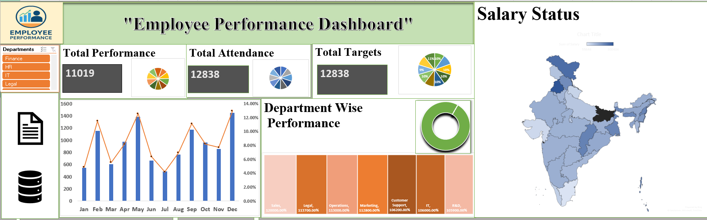
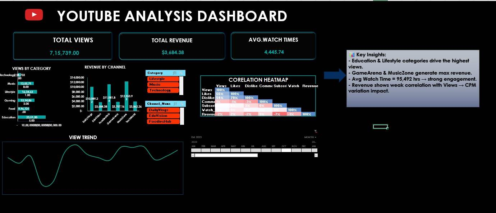
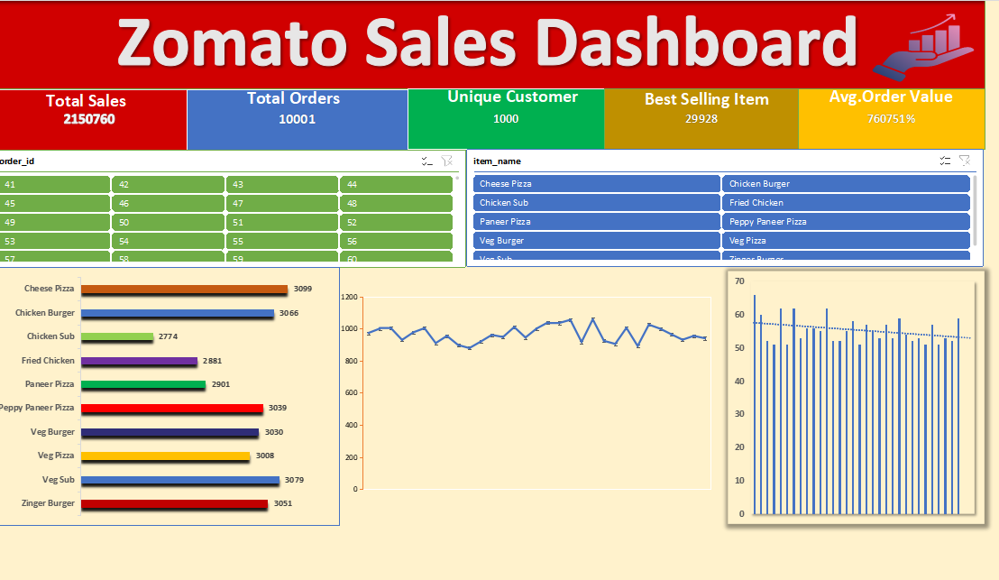

# 📊 Excel Projects

This repository contains my Excel projects and dashboards.  
Each project includes dataset samples, objectives, and visualizations created with Excel features.  

---

## 1. Employee Performance Dashboard
- **Objective**: Analyze employee KPIs and performance trends  
- **Skills**: Pivot Tables, Charts, Conditional Formatting  
 **File**: [Employee performance.xlsx](Employee%20performance.xlsx)  
- **Preview**:  
  
---

## 2. YouTube Analysis Dashboard
- **Objective**: Track YouTube views, likes, and subscriber growth  
- **Skills**: Pivot Charts, Slicers, KPI tracking  
-  **File**: [Youtube analysis dashboard.xlsx](Youtube%20analysis%20dashboard.xlsx)  
- **Preview**:  
  

---

## 3. Zomato Sales Analysis
- **Objective**: Analyze restaurant sales and revenue trends  
- **Skills**: Pivot Tables, Conditional Formatting, Charts  
-  **File**: [Zomato sales.xlsx](Zomato-sales.xlsx)  
- **Preview**:  
  
---

⚠️ **Note**: Excel files cannot be previewed directly on GitHub.  
Please download the `.xlsx` file and open it in Microsoft Excel.  
